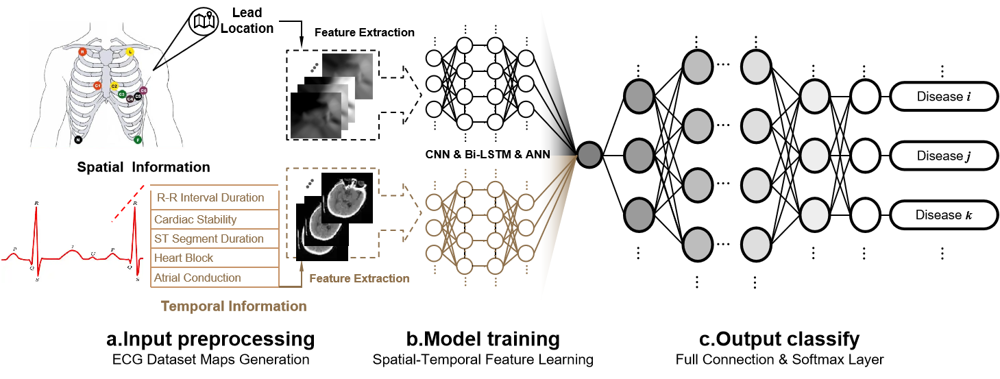

# 💓 ECG Analysis & Synthesis Toolkit
```
  ______ ______ _____   _______          _ _    _ _   
 |  ____|  ____/ ____| |__   __|        | | |  (_) |  
 | |__  | |__ | |  __     | | ___   ___ | | | ___| |_ 
 |  __| |  __|| | |_ |    | |/ _ \ / _ \| | |/ / | __|
 | |____| |___| |__| |    | | (_) | (_) | |   <| | |_ 
 |______|______\_____|    |_|\___/ \___/|_|_|\_\_|\__|
```

<div align="center">

[](https://www.python.org/downloads/)
[](LICENSE)
[](CONTRIBUTING.md)

🔬 A comprehensive toolkit for ECG signal analysis, synthesis, and classification

[Key Features](#key-features) •
[Installation](#installation) •
[Usage](#usage) •
[Documentation](#documentation) •
[Contributing](#contributing)

</div>

---

## 🌟 Key Features

- 🔄 **Synthetic ECG Generation**: Advanced deep learning models for ECG synthesis
- 🎯 **Classification**: Neural network-based diagnostic classification
- 📊 **Spectral Analysis**: Comprehensive power spectrum analysis tools
- 🧬 **Latent Space Exploration**: Advanced signal manipulation capabilities
- 📈 **Quality Metrics**: Implementation of IS and FID metrics

## 🚀 Quick Start

```bash
# Clone the repository
git clone https://github.com/yourusername/ecg-toolkit.git

# Install dependencies
pip install -r requirements.txt

# Run preprocessing
python processing.py
```

## 📦 Components

```
📁 ECG-Toolkit
├── 📂 SyntheticECG-main/      # Core synthetic generation package
├── 📜 autoencoder.py          # Autoencoder implementation
├── 📜 classifier.py           # Classification models
├── 📜 IS_and_FID.py          # Quality metrics calculation
├── 📜 laten.py               # Latent space tools
├── 📜 power_spectrum_analysis.py  # Spectral analysis
├── 📜 processing.py          # Data preprocessing
└── 📓 compare_ECG.ipynb      # Analysis notebook
```

## 💡 Usage Examples

### Synthetic ECG Generation
```python
from synthetic_ecg import ECGGenerator

generator = ECGGenerator()
synthetic_signal = generator.generate()
```

### Classification
```python
from classifier import ECGClassifier

classifier = ECGClassifier()
prediction = classifier.predict(ecg_signal)
```

## 📊 Analysis Tools

Our toolkit provides comprehensive analysis capabilities:

- **Power Spectrum Analysis**: Frequency domain analysis
- **Latent Space Manipulation**: Signal characteristic exploration
- **Quality Assessment**: Automated quality metric calculation

## 📈 Visualization

Example performance visualization:



## 🛠️ Development Setup

1. Fork the repository
2. Create a feature branch
3. Install development dependencies:
```bash
pip install -r requirements-dev.txt
```

## 🤝 Contributing

Contributions are welcome! Please feel free to submit a Pull Request. For major changes, please open an issue first to discuss what you would like to change.

## 📄 License

This project is licensed under the MIT License - see the [LICENSE](LICENSE) file for details.

## 📬 Contact

For questions and support, please open an issue or contact the maintainers.

---

<div align="center">
Made with ❤️ for the ECG research community
</div>
